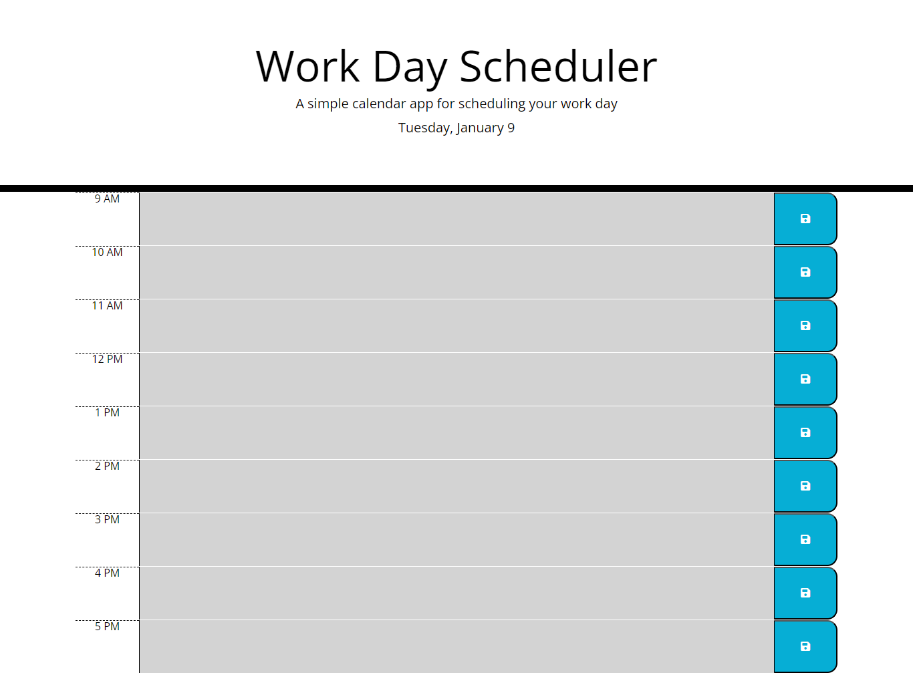

# work-day-schedular
A productivity-enhancing application designed to help users organize and optimize their work day

# Links
https://github.com/rashid-subhani/work-day-schedular
https://rashid-subhani.github.io/work-day-schedular/

# screenshort

# Steps taken
Function to display current date,
gets current hour,
loop for hours,
check the time block,
get save event from local storage,
save button and save event to local storage,
call functions
